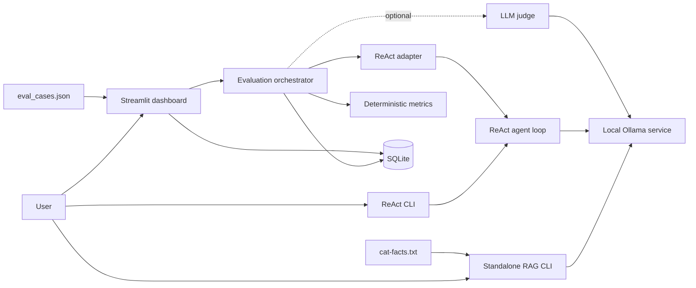
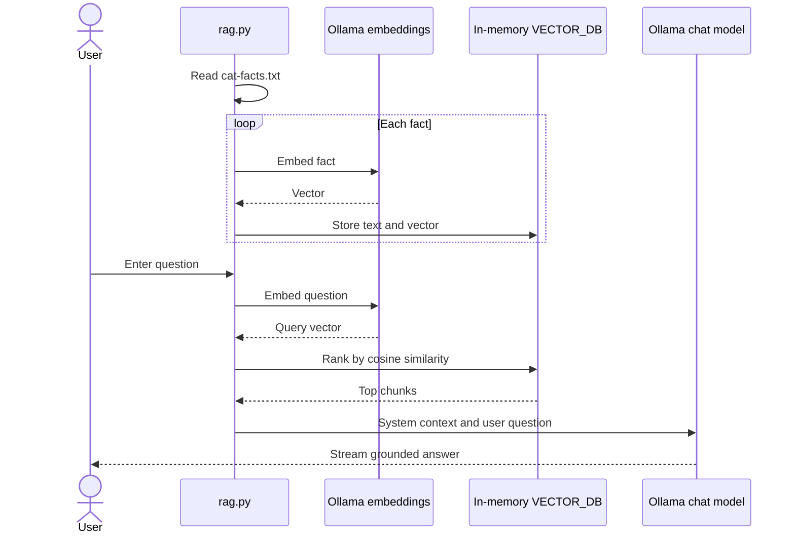
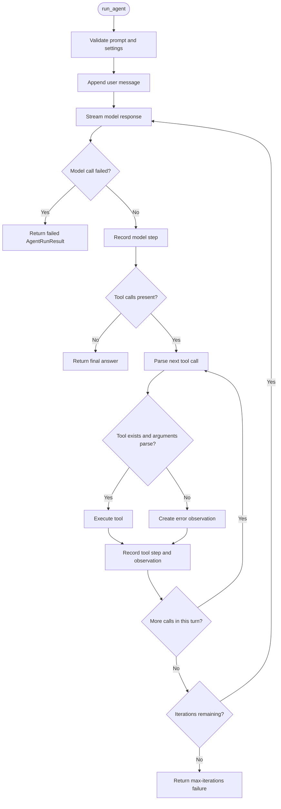
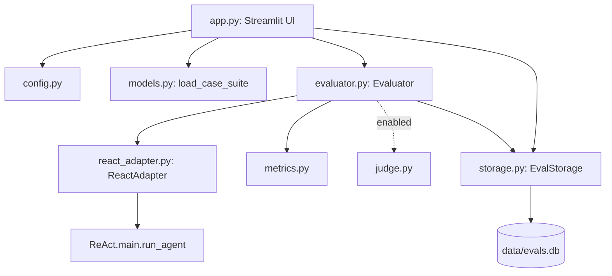
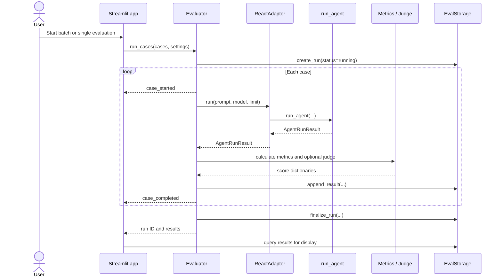
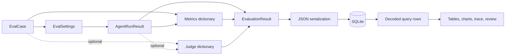

# Project Architecture

## 1. Purpose and scope

This repository contains three related local-AI examples:

1. **Retrieval-augmented generation (RAG)** in [`rag.py`](rag.py), which embeds a text dataset, retrieves relevant facts, and supplies them to a language model.
2. **A ReAct-style tool-calling agent** in [`ReAct/main.py`](ReAct/main.py), which repeatedly asks a model what to do, executes requested tools, and feeds observations back to the model.
3. **An evaluation platform** in [`evals-platform/`](evals-platform/), which runs the real ReAct agent against test cases, calculates deterministic metrics, optionally asks another model to judge the run, stores results in SQLite, and presents them in a Streamlit dashboard.

The implementation is intentionally local and small. Ollama supplies embeddings and chat completion, the RAG index lives in memory, and evaluation history lives in a local SQLite database.

## 2. Repository map

| Path | Responsibility |
| --- | --- |
| [`cat-facts.txt`](cat-facts.txt) | Newline-delimited source documents for the RAG example. |
| [`rag.py`](rag.py) | Standalone, interactive RAG pipeline. |
| [`ReAct/main.py`](ReAct/main.py) | Canonical tool definitions, agent loop, trajectory capture, and command-line example. |
| [`ReAct/__init__.py`](ReAct/__init__.py) | Public imports for the ReAct package. |
| [`evals-platform/app.py`](evals-platform/app.py) | Streamlit dashboard and user interaction layer. |
| [`evals-platform/data/eval_cases.json`](evals-platform/data/eval_cases.json) | Versioned evaluation case suite. |
| [`evals-platform/evals_platform/config.py`](evals-platform/evals_platform/config.py) | Environment-aware paths and runtime defaults. |
| [`evals-platform/evals_platform/models.py`](evals-platform/evals_platform/models.py) | Evaluation cases, settings, and result data contracts. |
| [`evals-platform/evals_platform/react_adapter.py`](evals-platform/evals_platform/react_adapter.py) | Thin boundary from the evaluator to the real ReAct agent. |
| [`evals-platform/evals_platform/evaluator.py`](evals-platform/evals_platform/evaluator.py) | Evaluation orchestration and per-case fault isolation. |
| [`evals-platform/evals_platform/metrics.py`](evals-platform/evals_platform/metrics.py) | Deterministic trajectory and answer scoring. |
| [`evals-platform/evals_platform/judge.py`](evals-platform/evals_platform/judge.py) | Optional Ollama-based qualitative judge. |
| [`evals-platform/evals_platform/storage.py`](evals-platform/evals_platform/storage.py) | SQLite schema, writes, queries, and manual reviews. |
| [`evals-platform/tests/`](evals-platform/tests/) | Offline unit and integration tests using injected fake model clients. |

## 3. System context

There is no network service between the dashboard and the agent. The dashboard imports the evaluator, the evaluator calls the adapter, and the adapter directly invokes `ReAct.main.run_agent()`. This keeps evaluation behavior aligned with the canonical agent implementation.

## 4. Standalone RAG pipeline

### 4.1 Index construction

[`rag.py`](rag.py) reads each non-empty line from [`cat-facts.txt`](cat-facts.txt) as an independent chunk. For every chunk:

1. `add_chunk_to_database()` calls `ollama.embed()` with `EMBEDDING_MODEL`.
2. Ollama returns a numeric embedding vector.
3. The code appends `(chunk_text, embedding)` to the process-local `VECTOR_DB` list.

The index is rebuilt every time the process starts. There is no vector database, on-disk cache, chunk overlap, or metadata layer.

### 4.2 Retrieval

When a user enters a question, `retrieve()`:

1. Embeds the question with the same embedding model.
2. Calculates cosine similarity between the query vector and every stored chunk vector.
3. Sorts candidates by similarity in descending order.
4. Returns the top `n` chunks and their scores.

For query vector $q$ and document vector $d$, cosine similarity is:

$$
\operatorname{similarity}(q,d) = \frac{q \cdot d}{\lVert q \rVert\lVert d \rVert}
$$

Using one embedding model for both documents and queries ensures that both vector types occupy the same semantic space.

### 4.3 Grounded generation

The retrieved chunks are joined into context and inserted into a system message. The original question is sent as the user message. `ollama.chat()` then streams the language-model response to the terminal.

The model is instructed to use only the supplied context. That instruction improves grounding, but the application does not independently verify citations or factual consistency.

## 5. ReAct agent

### 5.1 ReAct pattern

ReAct combines model reasoning with actions. In this project, a model turn can either:

- return a normal answer, which terminates the run; or
- request one or more tools, which causes the application to execute those tools and send their observations back to the model.

The loop is bounded by `max_iterations`, preventing a model from requesting tools indefinitely.

### 5.2 Tools and schemas

The default tool schema describes `get_current_weather(location)`. The corresponding callable is registered in `AVAILABLE_TOOLS`. The schema tells the model what it may request; the registry determines what Python code actually executes.

Keeping these concepts separate is important:

- A **schema** is model-facing JSON metadata: name, description, parameters, and required fields.
- A **registry entry** is an application-facing callable selected by tool name.

The included weather tool returns deterministic, hard-coded observations for London, Tokyo, and New York. It is an agent-control-flow example, not a live weather integration.

### 5.3 Agent loop

`run_agent()` is the canonical orchestration function. It accepts a prompt and optional dependencies such as prior messages, a model name, an iteration limit, tool schemas, a tool registry, an event callback, and an injected chat client.

Its control flow is:

1. Validate the prompt and iteration limit.
2. Copy any prior conversation and append the new user message.
3. Call the model with the current messages and available tool schemas.
4. Stream text fragments and collect tool calls from the model response.
5. Record a model step in the trajectory.
6. If the model requested no tools, return its content as the final answer.
7. Otherwise, parse each tool call, resolve its callable, and execute it.
8. Record each result or error as a tool step and append a tool observation message.
9. Return to step 3 so the model can reason over those observations.
10. Fail with `max_iterations` if no final answer is produced within the configured bound.

### 5.4 Message history and trajectory

The agent keeps two related records:

- `messages` is the model-facing conversation containing user, assistant, and tool messages.
- `steps` is the evaluator-facing execution trace containing normalized model and tool activity.

Each `AgentStep` records its kind, iteration, generated content or tool metadata, success state, error details, and latency. `AgentRunResult` adds the final status, termination reason, answer, message history, iteration count, latency totals, and top-level error information.

This distinction allows the model protocol to evolve while the evaluation system consumes a stable trace.

### 5.5 Status and termination semantics

Typical outcomes are:

| Agent status | Termination reason | Meaning |
| --- | --- | --- |
| `completed` | `final_answer` | The model returned an answer and all recorded actions succeeded. |
| `completed_with_errors` | `final_answer` | The model returned an answer after one or more recoverable tool errors. |
| `failed` | `model_error` | The model call raised an exception. |
| `failed` | `max_iterations` | The loop exhausted its allowed turns without a final answer. |

Tool failures are recoverable. They become observations, allowing the model to explain the problem or try another action. Model failures are terminal because the loop cannot continue without a model response.

### 5.6 Events and dependency injection

`event_callback` receives streaming and lifecycle events without controlling agent behavior. The dashboard uses these events to show live progress.

`chat_client`, custom tool schemas, and a custom tool registry can be injected. Tests use this design to replace Ollama with deterministic fakes and exercise the real loop offline.

## 6. Evaluation platform

### 6.1 Layered design

The evaluation platform separates UI, orchestration, agent integration, scoring, and persistence:

- **UI layer:** collects settings and presents runs, charts, traces, and reviews.
- **Application layer:** coordinates complete evaluations through `Evaluator`.
- **Integration layer:** calls the agent through `ReactAdapter`.
- **Domain layer:** represents cases, settings, and results with dataclasses.
- **Scoring layer:** calculates repeatable metrics and optional qualitative scores.
- **Persistence layer:** owns SQLite details and JSON serialization.

### 6.2 Configuration

`load_config()` builds an `AppConfig` with repository-aware default paths and environment overrides.

| Environment variable | Purpose |
| --- | --- |
| `EVALS_AGENT_MODEL` | Default model used by the evaluated agent. |
| `EVALS_MAX_ITERATIONS` | Default upper bound for agent turns. |
| `EVALS_JUDGE_MODEL` | Model used by the optional judge. |
| `EVALS_JUDGE_ENABLED` | Enables or disables judge scoring by default. |
| `EVALS_DATABASE_PATH` | Overrides the SQLite database location. |
| `EVALS_CASE_SUITE_PATH` | Overrides the evaluation case-suite location. |

Defaults resolve relative to the evaluation-platform directory. Relative environment overrides resolve from the current working directory.

### 6.3 Evaluation cases

`load_case_suite()` reads the JSON suite into immutable `EvalCase` values. A case can specify:

- a stable ID and input prompt;
- expected tool names and arguments;
- expected terms in tool observations;
- expected and forbidden terms in the final answer;
- tags and difficulty metadata; and
- an optional per-case iteration limit.

The top-level schema version is validated, malformed structures are rejected, and duplicate case IDs are disallowed. Every persisted result includes a snapshot of its case so historical runs remain interpretable even after the source suite changes.

### 6.4 Evaluation orchestration

`Evaluator.run_cases()` creates one run and evaluates each selected case independently:

1. Persist a running `eval_runs` record.
2. Build the optional judge once for the run.
3. Emit a `case_started` progress event.
4. Call `ReactAdapter.run()` with the case prompt and effective settings.
5. Calculate deterministic metrics from the case expectations and agent trace.
6. Optionally request qualitative judge scores.
7. Map agent status to evaluation status.
8. Persist an `EvaluationResult`.
9. Emit a `case_completed` event.
10. Finalize the aggregate run status.

A case-level exception is converted into a failed result rather than aborting the remaining cases. An orchestration or storage failure outside that isolated work marks the whole run failed and is re-raised.

### 6.5 Deterministic metrics

`calculate_metrics()` scores behavior without another model. It accepts object-shaped or dictionary-shaped agent results, making it usable with production results and test fixtures.

#### Tool-call metrics

Expected and actual calls are normalized and matched without considering order. Tool names and string argument values ignore case and repeated whitespace. Calls are treated as a multiset, so duplicate calls remain meaningful.

$$
\text{precision}=\frac{\text{matched calls}}{\text{actual calls}}
$$

$$
\text{recall}=\frac{\text{matched calls}}{\text{expected calls}}
$$

$$
F_1=2\cdot\frac{\text{precision}\cdot\text{recall}}{\text{precision}+\text{recall}}
$$

Extra calls reduce precision; missing calls reduce recall. When neither expected nor actual calls exist, all three tool-call scores are `1.0`.

#### Argument metrics

Expected calls are paired with same-named actual calls. The implementation favors the candidate with the greatest number of matching values. It reports:

- `argument_match`: matching expected values divided by expected argument keys;
- `argument_completeness`: present expected keys divided by expected argument keys.

#### Text and execution metrics

The evaluator also calculates:

- expected observation-term recall;
- expected answer-term recall;
- forbidden answer-term violations and the matched terms;
- tool execution success rate;
- tool-call and model-iteration counts;
- whether the iteration limit was reached; and
- model, tool, and total latency.

Metrics with no applicable expectation are generally stored as `null` rather than implying success or failure.

### 6.6 Optional LLM judge

`OllamaJudge` receives the case, trajectory, and final answer and asks an Ollama model for three scores between 0 and 1:

- task success;
- groundedness; and
- tool-use appropriateness.

Judge output is supplementary because it is model-dependent and non-deterministic. The parser accepts plain or Markdown-fenced JSON and validates score ranges. An unavailable model, malformed output, or invalid score becomes a structured judge error; deterministic metrics and the evaluation result are still retained.

### 6.7 Persistence

`EvalStorage` initializes a local SQLite database in WAL mode with foreign keys and a busy timeout.

The `eval_runs` table stores run-level configuration and lifecycle state. The `eval_results` table stores:

- a case snapshot and prompt;
- agent status, termination reason, answer, messages, and steps;
- deterministic metrics and optional judge output;
- latency and error information; and
- manual verdict, notes, and review timestamp.

Nested structures are encoded as JSON at the storage boundary. Query methods decode them back to Python values and expose metric keys in flattened form for dashboard tables and charts. Parameterized SQL is used for filters and writes.

The default database is `evals-platform/data/evals.db`. It is generated at runtime and is not source data.

### 6.8 Dashboard

[`evals-platform/app.py`](evals-platform/app.py) constructs the configuration, storage, evaluator, and case suite, then renders three workflows:

- **Overview:** aggregate counts, completion and quality metrics, trend charts, latency charts, and recent runs.
- **Run evaluations:** batch-suite selection or an ad hoc single case, model and iteration settings, optional judge settings, progress, and live trace information.
- **Result explorer:** filters, trajectory inspection, stored messages and metrics, judge details, and manual pass/fail review.

Streamlit reruns the script after interactions, so durable evaluation state belongs in SQLite. Only transient UI values, such as the latest run ID, belong in `st.session_state`.

## 7. End-to-end data lifecycle

The important boundary objects are:

- `EvalCase`: what should happen;
- `EvalSettings`: how to execute the case;
- `AgentRunResult`: what the agent actually did;
- metrics and judge dictionaries: how the run was scored; and
- `EvaluationResult`: the complete persisted case outcome.

## 8. Testing strategy

Tests under [`evals-platform/tests/`](evals-platform/tests/) avoid a live Ollama dependency by injecting fake chat clients with queued responses.

- Agent tests validate tool round trips, direct answers, model failures, unknown tools, and iteration exhaustion.
- Metric tests validate normalization, unordered matching, missing and extra calls, argument scoring, term recall, forbidden terms, and no-tool edge cases.
- Judge tests validate fenced JSON parsing and score constraints.
- Storage and evaluator tests validate SQLite round trips, filtering, metric flattening, reviews, mixed-result batches, and run finalization.

This structure tests the actual control flow while replacing only the non-deterministic model boundary.

## 9. Failure boundaries

| Boundary | Behavior |
| --- | --- |
| RAG embedding or chat request | The interactive script receives the Ollama exception; it has no retry or fallback layer. |
| Agent model call | A failed model step is recorded and the run terminates as failed. |
| Agent tool call | The error becomes an observation; the model may recover on the next turn. |
| Event callback | Callback failures do not alter agent behavior. |
| Individual evaluation case | The exception is captured as a failed result and the batch continues. |
| LLM judge | A structured judge error is stored without discarding deterministic scores. |
| Evaluation infrastructure | The run is finalized as failed and the error is propagated. |
| SQLite contention | WAL mode and the busy timeout improve local concurrent read/write behavior. |

## 10. Extension points

### Add or replace an agent tool

1. Implement the Python callable in [`ReAct/main.py`](ReAct/main.py).
2. Add its model-facing JSON schema.
3. Register the callable under exactly the same tool name.
4. Add cases to [`evals-platform/data/eval_cases.json`](evals-platform/data/eval_cases.json).
5. Add agent-loop and metric tests for success and failure paths.

For side-effecting tools, add per-case setup, sandboxing, and teardown before using them in repeatable batch evaluations.

### Add a deterministic metric

1. Calculate it in [`evals-platform/evals_platform/metrics.py`](evals-platform/evals_platform/metrics.py).
2. Return it from `calculate_metrics()`.
3. Add focused tests in [`evals-platform/tests/test_metrics.py`](evals-platform/tests/test_metrics.py).
4. Surface it in the dashboard if it benefits aggregate analysis.

Because metrics are stored as JSON, a new metric usually does not require a database migration.

### Evaluate another agent

Implement an adapter with the same effective contract as `ReactAdapter.run()`, returning an `AgentRunResult`-compatible object, and inject it into `Evaluator`. Keeping the adapter narrow avoids coupling the evaluator to another agent framework.

### Add richer retrieval

The RAG example can evolve independently by replacing the in-memory list with a persistent vector index, adding chunk metadata, or adding source citations. If retrieval becomes an agent tool, define a schema and registry callable and then evaluate retrieval behavior through expected calls and observation terms.

### Evolve persistence

Keep flexible and infrequently queried fields in JSON. Promote a field to a normalized SQLite column only when filtering, indexing, aggregation, or migration requirements justify it.

## 11. Runtime requirements and entry points

The project expects Python and a locally running Ollama service.

- Run the standalone RAG example from the repository root with `python rag.py` after making its embedding and language models available in Ollama.
- Run the dashboard from [`evals-platform/`](evals-platform/) with `python -m streamlit run app.py` after installing [`evals-platform/requirements.txt`](evals-platform/requirements.txt) and pulling `llama3.2:3b`.
- Run evaluation tests from [`evals-platform/`](evals-platform/) with `python -m pytest`. The tests do not require Ollama.

## 12. Design trade-offs

The architecture favors clarity and inspectability over production scale:

- Direct Python calls are simpler than introducing an API boundary.
- A bounded synchronous loop is easier to trace than distributed agent execution.
- JSON snapshots preserve evolving traces without frequent schema migrations.
- SQLite is sufficient for a local dashboard and manual reviews.
- Deterministic metrics are primary; an LLM judge is explicitly optional.
- Injected model clients make control-flow tests fast and repeatable.

For a production deployment, likely next steps would include authentication, secret management, request concurrency controls, retries and timeouts, persistent vector storage, migrations, model/version provenance, trace correlation, and sandboxing for side-effecting tools.
